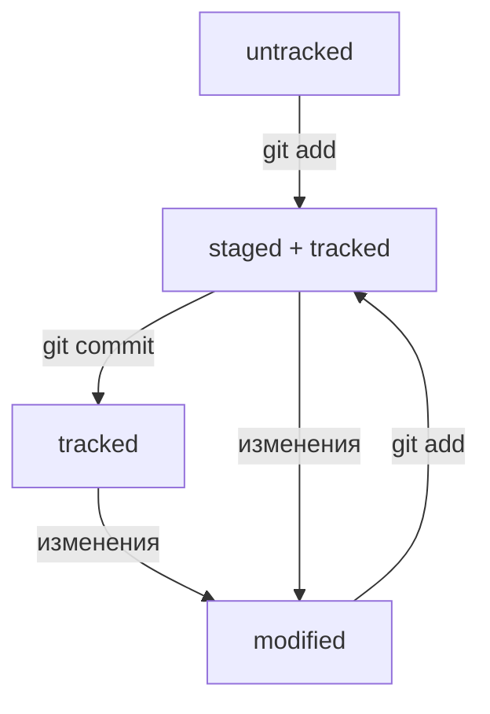
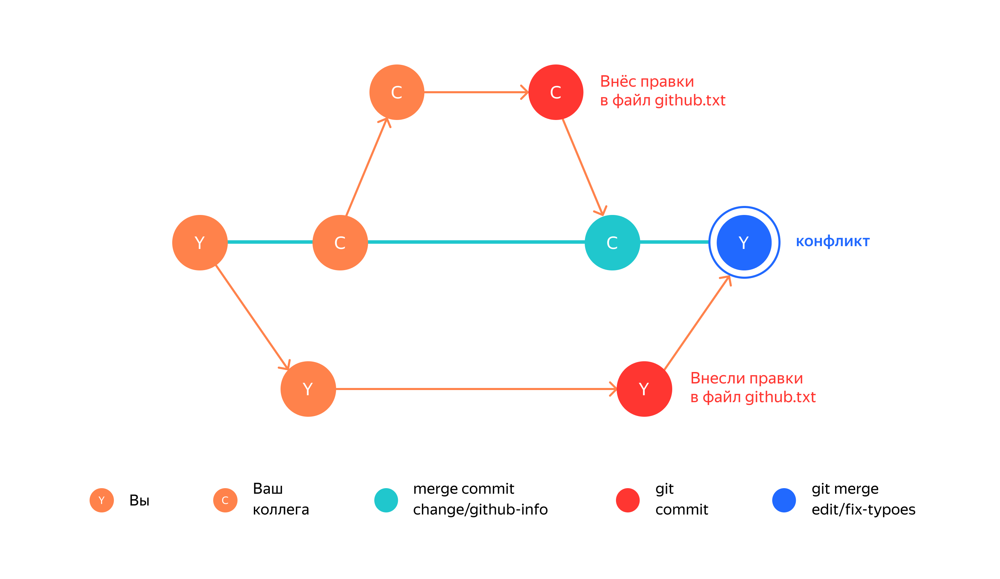

# git-guide

### это шпаргалка, в которой будут какие-то вспомогательные команды для работы с **git** и, в целом, с командной строкой
---
### Базовые комбинация для залития измений с локального на удаленный репозиторий.
##### Для того, чтобы сделать commit требуется:<br>
1. Перепроверить все ли изменения были внесены в нужные файлы, можно использовать команду для проверки изменений на ветке:  
```bash
  git status
```

2. Добавляем измененные фыайлы в commit:
```bash
  git add *путь к файлу*
```

3. Затем пишем сообщение, которым будет сопровождаться созданный commit, сообщение должно быть кратким и отражать суть изменений файла:
```bash
  git commit -m "feat(kb): change prompt for sense"
```

4. Пушим изменения в удаленную ветку на github, обязательно проверьте куда вы хотите запушить изменения:
```bash
  git push origin main
```

---

#### Изменения добавлены!  
##### Проверить ветку, в которую вы хотите запушить изменения можно двумя способами
1. 
```bash
  git status
```
благодаря этой команде можно, в целом, посмотреть текущее состояние ветки, изменения и, естественно, будет отображено название ветки, на которой вы сейчас находитесь.

2.  
```bash
  git branch
```

---

### Понятие хеша коммита
По сути хеш - это идентификатор коммита, то есть то, благодаря чему мы можем отличать коммиты друг от друга, в командной строке это выглядит следующим образом:
```bash
  commit 463057447f4b3ec75fc6bd3dcb150588678fba58 (HEAD -> main, origin/main, origin/HEAD)
```
Информация о коммите — это набор данных: когда был сделан коммит, содержимое файлов в репозитории на момент коммита и ссылка на предыдущий, или **родительский** (англ. parent), коммит.

[SHA Online](https://emn178.github.io/online-tools/sha1.html "Посмотри, как изменяется коммит при добавлении минимальных символов в него!")

Посмотреть информацию о коммитах можно с помощью команды:
```bash
  git log
```

Сокращенный лог:
```bash
  git log --oneline
```

Сокращённый лог полезен, если в репозитории уже много коммитов — например, сотни или тысячи. В этом случае можно быстро найти нужный по описанию.
#### Сокращённый хеш (то есть первые несколько символов полного) можно использовать точно так же, как и полный.

Для того, чтобы выйти из просмотра лог, можно ввести **G**

**Пример описания информации о коммите:**  


```bash
  HEAD
```

указывает на коммит, который был сделан последним. **Вместо хеша последнего коммита можно написать слово HEAD**

```bash
  ls
```

с помощью этой команды вы можете посмотреть содержимые файлы и папки

```bash
  cat HEAD
```

покажет содержимое файла

### Статусы файлов

1. Новые файлы в Git-репозитории помечаются как **untracked**, то есть неотслеживаемые. Git «видит», что такой файл существует, но не следит за изменениями в нём. У untracked-файла нет предыдущих версий, зафиксированных в коммитах или через команду **git add**.

2. После выполнения команды git add файл попадает в staging area, то есть в список файлов, которые войдут в коммит. В этот момент файл находится в состоянии **staged**.

3. Состояние **tracked** — это противоположность untracked. Оно довольно широкое по смыслу: в него попадают файлы, которые уже были зафиксированы с помощью git commit, а также файлы, которые были добавлены в staging area командой
```bash
  git add 
```

То есть все файлы, в которых Git так или иначе отслеживает изменения.

4. Состояние **modified** означает, что Git сравнил содержимое файла с последней сохранённой версией и нашёл отличия. Например, файл был закоммичен и после этого изменён.

**Пример изменения статуса файла:**  


#### !При добавлении изменений могут возникать конфликтные ситуации с основной веткой, чтобы этого избежать, перед началом работы на ветке, тем более перед ее созданием, необходимо забрать изменения с главной ветки, для этого необходима команда:

```bash
   git pull
```

Однако, если какие-то изменения уже производились, прежде чем воспользовать командой **git pull**, нужно скрыть эти изменения, как бы положить и в ячейку, чтобы потом достать:

```bash
   git stash
```

Полная картина будет выглядеть таким образом:

```bash
   git stash \\ скрыть изменения
   git pull  \\ забрать изменения из удаленной версии
   git stash pop  \\ добавить сокрытые изменения к локальной ветки, которая полностью идентична  теперь удаленной
```

---

### Исправление ошибок при создании неправильных коммитов до внесения их на гит:

Если вы хотите отменить последний коммит, но оставить все свои изменения в файлах, не удаляя их, необходима следующая команда:

```bash
   git reset --soft HEAD^
```
Если вы хотите вернуть состояние репозитория к предыдущему состоянию, отменив коммит с затиранием (вы удалите коммит и удалите все изменения, что внесли в коммит):

```bash
   git reset --hard <commit hash>
```
Пример:

```bash
$ git log --oneline # хеш можно найти в истории
7b972f5 (HEAD -> master) style: добавить комментарии, расставить отступы
b576d89 feat: добавить массив Expenses и цикл для добавления трат # вот сюда и вернёмся
4b58962 refactor: разделить analyzeExpenses() на countSum() и saveExpenses()

$ git reset --hard b576d89
# теперь мы на этом коммите
HEAD is now at b576d89 feat: добавить массив Expenses и цикл для добавления трат
```

*Теперь коммит b576d89 стал последним: вся дальнейшая разработка будет вестись от него. Файл также вернулся к тому состоянию, в котором был в момент этого коммита. А коммит 7b972f5 Git просто удалил.*


Однако полностью удалять коммит вовсе не обязательно, например вы могли забыть внести какие-то изменения в коммит, в таком случае достаточно просто добавить еще один файл в коммит с новыми изменениями. 

В таком случае можно внести правки в уже сделанный коммит с помощью опции **--amend** (добавить), однако важное замечание, что данная опция работает только с последним коммитом **HEAD**:

```bash
   git add common.css
   git commit --amend --no-edit
```

Опция --no-edit говорит, что сообщение коммита нужно оставить неизменным, однако хеш коммита изменится в любом случае.

Соответственно, мы можем поменять сообщение последнего коммита с помощью команды:

```bash
   git commit --amend -m "New message"
```

Если забыть указать у команды *git commit --amend* один из флагов (*--no-edit* или *-m*), Git предложит отредактировать сообщение коммита вручную. Для этого он откроет текстовый редактор, который установлен в системе по умолчанию. Чаще всего это либо GNU nano, либо Vim.

Если вы просто добавили лишний файл в **tracked**, вам коммандная строка сама подсказывает, что нужно просто использовать комманду:

```bash
   git restore --staged example.txt
```

Файл переместится в **untracked**.

Чтобы убрать все файлы можно использовать одну из опций:

```bash
   git restore --staged .
   git restore --staged --all
```

«Откатить» изменения, которые не попали ни в staging, ни в коммит:

```bash
   git restore <file>
```
---
### Просмотр изменений, которые были добавлны в последний коммит:

```bash
   git diff \\ просмотреть изменения в modifed
   git diff --staged \\ просмотреть изменения в staged файлах
```

```bash
   @@ -1,2 +1,2 @@ 
```
Эта строка сообщает, какие строки файла попали в сравнение. Выражение 1,2 (неважно, с плюсом или с минусом) говорит, что были использованы две строки, начиная с первой. Если бы было, например, написано +15,7, это значило бы, что в сравнении участвуют 7 строк, начиная с 15-й.

---
### Игнорирование файлов в Git

Чтобы игнорировать какие-то файлы (часто это какие-то ключи, либо настройка, возможно, проекта), необходимо поместить их в файл .gitignore - это обычный текстовый файл, он хранится в корне репозитории, и его также коммитят. В этот файл добавляются названия файлов, которые не должны помещаться на Git в открытый доступ, каждый с новой строки соответственно, либо же используют шаблоны.
Комментарии, то есть строки, начинающиеся с # Git не читает.
Также есть вот такие вспомогательные элементы:

```bash
   # игнорировать все файлы, которые заканчиваются на .jpeg
   *.jpeg

   # игнорировать все файлы "tmp" во всех подпапках папки docs
   docs/*/tmp

   # "игнорировать все файлы"
   *

   # ? - означает один символ, то есть file1.txt,file9.txt - будут игнорироваться, но file12.txt уже нет.
   file?.txt

   # игнорировать файлы file0.txt, file1.txt и file2.txt
   # при этом не игнорировать file3.txt, file4.txt, ...
   file[0-2].txt

   # игнорировать todo.txt в корне репозитория
   /todo.txt
   # для сравнения: spam.txt будет игнорироваться во всех папках
   spam.txt

   # если шаблон заканчивается слешем, то правило применится только к папке, если build название файла, то он игнорироваться не будет
   # игнорировать папку build
   build/

   # игнорировать файлы "docs/current/tmp", "docs/old/tmp",
   # а также "docs/old/saved/a/b/c/d/tmp"
   # и даже "docs/tmp", потому что ноль вложенных папок тоже подходит
   docs/**/tmp

   # игнорировать только "docs/current/tmp" и "docs/old/tmp"
   # файл "docs/old/saved/a/b/c/d/tmp" не попадает в правило
   docs/*/tmp

   # игнорировать все JPEG-файлы
   *.jpeg
   # но только не мем с Doge
   !doge.jpeg
```

Посмотреть все игнорируемые файлы можно с помощью команды:

```bash
   git status --ignored
```
---

### Работа с ветками Git
Создать ветку:

```bash
   git branch <название ветки>
```

Переключиться на нужную ветку:

```bash
   git checkout <название ветки>
```

Создать ветку и переключиться на нее:

```bash
   git checkout -b <название ветки>
```

Сравнивать ветки можно как и коммиты с помощью команды:

```bash
   git diff <название_ветки1> <название_ветки2>
```
Для облегчения этой задачи в Git есть суффикс навигации **~N**, где N — это число. Он отсчитывает от заданного коммита N коммитов назад во времени. Нумерация начинается с нуля: **commit~0** - это сам коммит, **commit~1** - предыдущий, **commit~2** — предшествующий предыдущему и так далее.
Например, **HEAD~1** — это следующий за текущим коммит. А **main~5** — это пятый коммит в ветке main, если считать с последнего выполненного коммита.

#### Объединение веток
Для того, чтобы внести изменения с другой ветки на главную необходимо выполнить следующие команды:

```bash
   git checkout main
   git merge <название ветки>
```
Также это можно сделать в веб версии Git.

**ВАЖНО** прежде чем мержить какие-либо изменения, нужно устранить все конфликты, чтобы случайно не удалить другие нужные изменения.
После того, как выполнили мерж, необходимо удалить ветку, чтобы не засорять проект ненужными ветками. Удалить ветку можно командой:

```bash
   git branch -D <название ветки>
```
Однако ветка удалится так только локально, лучше удалять ветку также на самом Git, после выполения команды слияния, Git сам предложит удалить ветку.

#### Конфликты

Иллюстрация того, как может возникнуть конфликт:



Во время слияния Git сам подсвечивает файлы, которые не смог объединить. Чтобы разобраться в ситуации, нужно сделать следующее:

1. Заглянуть в файл, где произошёл конфликт.
2. Изучить обе стороны конфликта — вашу версию и версию вашего коллеги. Ваша задача — правильно собрать две версии в итоговую, так чтобы изменения обеих сторон не потерялись. Новая версия станет текущей актуальной. 
3. Вручную удалить или подправить неактуальные изменения, если они есть.
4. Подготовить изменения к сохранению и сделать коммит.

Как решать такую проблему с точки зрения гита:

1. Если вы знаете, что ваш коллега внес какие-то изменения, но сами не успели еще внести новые в коммит (по сути это версия избегания конфликта):

```bash
   git checkout main \\ переключаемся на главную ветку
   git stash \\ скрываем свои изменения
   git pull \\ забираем изменения из удаленной ветки main
   git checkout <наша ветка> \\ переключаемся на нашу ветку, через которую хотели вносить изменения
   git rebase develop \\ по сути это тот же git pull && git merge
   git stash pop \\ возвращаем те изменения, которые не успели закоммитить
```

2. Если уже конфликт случился, то необходим такой путь решения:

```bash
   git checkout main \\ переключаемся на главную ветку
   git pull \\ забираем изменения из удаленной ветки main
   git checkout <наша ветка> \\ переключаемся на нашу ветку, через которую хотели вносить изменения
   git rebase develop \\ по сути это тот же git pull && git merge
  \\ на этом моменте как раз возникает конфликт
  \\ заходим в привычное вам IDE, соединчем безопасно чужие изменения и ваши
   git rebase --continue \\ если пока не можете внести свои изменения, так как не уверены можно сделать git rebase --abort
   git push origin <наша ветка> -f \\ то есть выполняем force push, чтобы принудительно заменить коммиты на новые правильные
```
3. Также вам может понадобиться сделать что-то с вашей веткой (соединить коммиты, так как они решают одну и ту же проблему, переименовать коммиты, удалить коммиты и т.д.) для этого мы можем использовать команду:

```bash
   git rebase -i HEAD~<количество коммитов>
```

После этой команды открывается история коммитов, которые вы сделали, <количество коммитов> означает, что появятся последнии N коммитов, которые вы запросили.

Вам в командной строке предоставятся коммиты, которые вы сделали и огромное количество команд, которые позволят отредактировать коммиты:

```bash                                                       
pick 4630574 fix: change README.md
pick fceb41a fix: update README.md
pick 385463a add hash description
pick fb43cab feat: add picture for hash description
pick 115ef87 add tracking description
pick 5b67625 fix: status description
pick 3be9f9c feat: add picture for status
pick bd0a64f feat: add mermaid table
pick b3cae03 feat: add commits features
pick bfb344e fix: code style
pick 4c78da3 feat: add commit's changes info
pick 95efeb8 fix: add picture for commit's info
pick c0bd473 fix: code style
pick fa1b770 fix: code style
pick c8dfb7c fix: fix code style
pick 798c7c7 feat: git diff
pick 641d4cd feat: work with gitignore
pick 9ad8368 feat: branches navigation
pick 2828a99 fix: code style
pick 66de8cc feat: add merge info
pick 6b43435 feat: add conflict.png

# Rebase 0cbc5a9..6b43435 onto 0cbc5a9 (21 commands)
#
# Commands:
# p, pick <commit> = use commit
# r, reword <commit> = use commit, but edit the commit message
# e, edit <commit> = use commit, but stop for amending
# s, squash <commit> = use commit, but meld into previous commit
# f, fixup [-C | -c] <commit> = like "squash" but keep only the previous
#                    commit's log message, unless -C is used, in which case
#                    keep only this commit's message; -c is same as -C but
#                    opens the editor
# x, exec <command> = run command (the rest of the line) using shell
# b, break = stop here (continue rebase later with 'git rebase --continue')
# d, drop <commit> = remove commit
# l, label <label> = label current HEAD with a name
# t, reset <label> = reset HEAD to a label
# m, merge [-C <commit> | -c <commit>] <label> [# <oneline>]
# .       create a merge commit using the original merge commit's
# .       message (or the oneline, if no original merge commit was
# .       specified); use -c <commit> to reword the commit message
#
# These lines can be re-ordered; they are executed from top to bottom.
#
# If you remove a line here THAT COMMIT WILL BE LOST.
#
# However, if you remove everything, the rebase will be aborted.
#
```
Для того, чтобы выполнить какую-либо команду вам достаточно заменить слово **pick** перед коммитом на одну букву, которая соответствует одной из команд.

Все команды довольно интуитивные, однако со слиянием нескольких коммитов могут возникнуть вопросы, поэтому рассмотрим вариант со слиянием нескольких коммитов:

#### Пример:

Допустим, мы захотели слить коммит c0bd473, fa1b770 и c8dfb7c, чтобы не засорят историю коммитов, что логично, так как они создавались примерно для одного и того же, судя по названию(хотя лучше перепроверить, мало ли вы давно делали эти коммиты и они просто имеют плохие комментирующие сообщения, почему собственно и важно сразу правильно комментировать коммиты).

Для того, чтобы это сделать на необходимо заменить нужные **pick** на **s**, то есть squash, вот таким образом (верхний коммит оставляем нетронутым, а все последующие, которые хотим с ним слить помечаем как **s**):

```bash                                                       
pick 4630574 fix: change README.md
pick fceb41a fix: update README.md
pick 385463a add hash description
pick fb43cab feat: add picture for hash description
pick 115ef87 add tracking description
pick 5b67625 fix: status description
pick 3be9f9c feat: add picture for status
pick bd0a64f feat: add mermaid table
pick b3cae03 feat: add commits features
pick bfb344e fix: code style
pick 4c78da3 feat: add commit's changes info
pick 95efeb8 fix: add picture for commit's info
pick c0bd473 fix: code style
s fa1b770 fix: code style
s c8dfb7c fix: fix code style
pick 798c7c7 feat: git diff
pick 641d4cd feat: work with gitignore
pick 9ad8368 feat: branches navigation
pick 2828a99 fix: code style
pick 66de8cc feat: add merge info
pick 6b43435 feat: add conflict.png
```

Нажимаем сочетание клавиш ctrl O для сохранения изменений и ctrl X для выхода из этого окна, после чего появляется вот такое окно редактирования:

```bash
# This is a combination of 3 commits.
# This is the 1st commit message:

fix: code style \\ изменяем верхний коммит на то, как вы хотели бы, чтобы помечался ваш слитый коммит
# This is the commit message #2:

fix: code style
# This is the commit message #3:

fix: fix code style

# Please enter the commit message for your changes. Lines starting
# with '#' will be ignored, and an empty message aborts the commit.
#
# Author:    Natashka Malinovskaya <63506873+Malina09@users.noreply.github.com>
# Date:      Wed Aug 9 13:38:36 2023 +0300
#
# interactive rebase in progress; onto 0cbc5a9
# Last commands done (15 commands done):
#    squash fa1b770 fix: code style
#    squash c8dfb7c fix: fix code style
# Next commands to do (6 remaining commands):
#    pick 798c7c7 feat: git diff
#    pick 641d4cd feat: work with gitignore
# You are currently rebasing branch 'main' on '0cbc5a9'.
#
# Changes to be committed:
#       modified:   README.md
#
```
локально вы поменяли все коммиты, как хотели, после чего нужно ввести команду:

```bash
   git push origin <наша ветка> -f \\ то есть выполняем force push, чтобы принудительно заменить коммиты на новые правильные
```

>  Однако **force push** может оказаться довольно каверзной командой и нужно учитывать некоторые обстоятельства при использовании этой команды:
> * Можно затереть чужие изменения; если вы изменили что-то, после чего сделали force push, git возьмет именно эту версию для слияния с основной веткой;
> * Не точная последовательность коммитов относительно старой версии;
>     * например у вас было 12 коммитов, и вы захотели сократить их количество или поменять последовательность, вы сделали force push, но у вашего коллеги осталась предыдущая версия, вероятно, у него возникнут конфликты, если человек опытный скорее всего он поймет в чем дело, и не станет просто бездумно править конфликты, которые предлагает git, однако если у человека не так много опыта, он может просто начать решать конфликты, еще и накосячит в их решении, после чего сделает push, при push не проверит, что он пушит не только свои коммиты, которые собирался, но и старые версии коммитов отребэйженные на новые версии и это будет мягко говоря очень неприятной ситуацией, затрутся ваши изменения, в итоге решение этой проблемы займет очень много времени, поэтому нужно внимательно следить за историей коммитов, и, желательно, предупреждать коллег о том, что собираетесь сделать force push.
