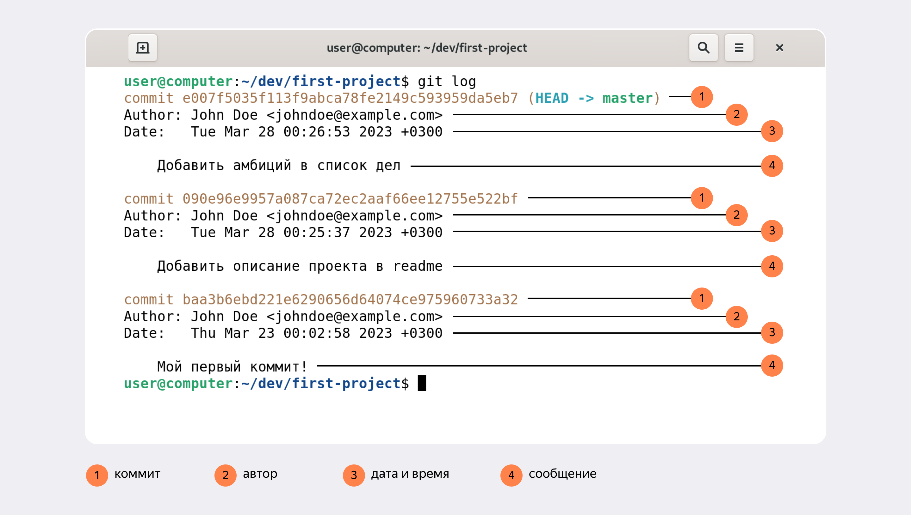
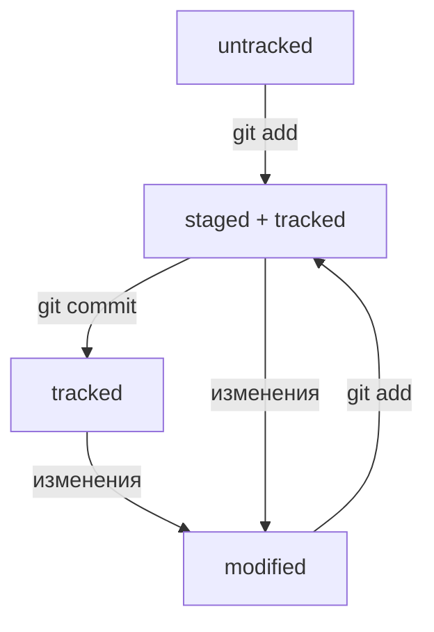
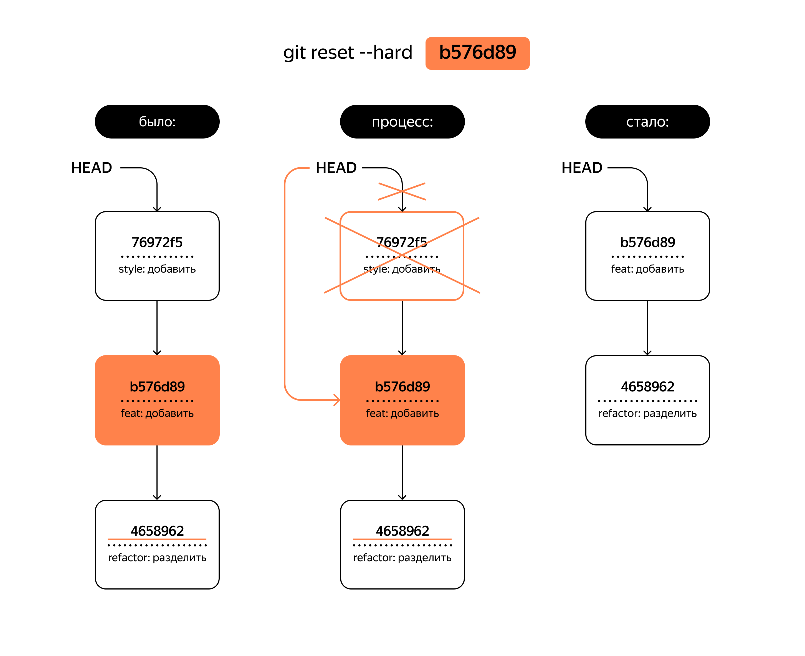

# git-guide

### это шпаргалка, в которой будут какие-то вспомогательные команды для работы с **git** и, в целом, с командной строкой
---
### Базовые комбинация для залития измений с локального на удаленный репозиторий.
##### Для того, чтобы сделать commit требуется:<br>
1. Перепроверить все ли изменения были внесены в нужные файлы, можно использовать команду для проверки изменений на ветке:  
```bash
  git status
```

2. Добавляем измененные фыайлы в commit:
```bash
  git add *путь к файлу*
```

3. Затем пишем сообщение, которым будет сопровождаться созданный commit, сообщение должно быть кратким и отражать суть изменений файла:
```bash
  git commit -m "feat(kb): change prompt for sense"
```

4. Пушим изменения в удаленную ветку на github, обязательно проверьте куда вы хотите запушить изменения:
```bash
  git push origin main
```

---

#### Изменения добавлены!  
##### Проверить ветку, в которую вы хотите запушить изменения можно двумя способами
1. 
```bash
  git status
```
благодаря этой команде можно, в целом, посмотреть текущее состояние ветки, изменения и, естественно, будет отображено название ветки, на которой вы сейчас находитесь.

2.  
```bash
  git branch
```

---

### Понятие хеша коммита
По сути хеш - это идентификатор коммита, то есть то, благодаря чему мы можем отличать коммиты друг от друга, в командной строке это выглядит следующим образом:
```bash
  commit 463057447f4b3ec75fc6bd3dcb150588678fba58 (HEAD -> main, origin/main, origin/HEAD)
```
Информация о коммите — это набор данных: когда был сделан коммит, содержимое файлов в репозитории на момент коммита и ссылка на предыдущий, или **родительский** (англ. parent), коммит.

[SHA Online](https://emn178.github.io/online-tools/sha1.html "Посмотри, как изменяется коммит при добавлении минимальных символов в него!")

Посмотреть информацию о коммитах можно с помощью команды:
```bash
  git log
```

Сокращенный лог:
```bash
  git log --oneline
```

Сокращённый лог полезен, если в репозитории уже много коммитов — например, сотни или тысячи. В этом случае можно быстро найти нужный по описанию.
#### Сокращённый хеш (то есть первые несколько символов полного) можно использовать точно так же, как и полный.

Для того, чтобы выйти из просмотра лог, можно ввести **G**

**Пример описания информации о коммите:**  


```bash
  HEAD
```

указывает на коммит, который был сделан последним. **Вместо хеша последнего коммита можно написать слово HEAD**

```bash
  ls
```

с помощью этой команды вы можете посмотреть содержимые файлы и папки

```bash
  cat HEAD
```

покажет содержимое файла

### Статусы файлов

1. Новые файлы в Git-репозитории помечаются как **untracked**, то есть неотслеживаемые. Git «видит», что такой файл существует, но не следит за изменениями в нём. У untracked-файла нет предыдущих версий, зафиксированных в коммитах или через команду **git add**.

2. После выполнения команды git add файл попадает в staging area, то есть в список файлов, которые войдут в коммит. В этот момент файл находится в состоянии **staged**.

3. Состояние **tracked** — это противоположность untracked. Оно довольно широкое по смыслу: в него попадают файлы, которые уже были зафиксированы с помощью git commit, а также файлы, которые были добавлены в staging area командой
```bash
  git add 
```

То есть все файлы, в которых Git так или иначе отслеживает изменения.

4. Состояние **modified** означает, что Git сравнил содержимое файла с последней сохранённой версией и нашёл отличия. Например, файл был закоммичен и после этого изменён.

**Пример изменения статуса файла:**  


#### !При добавлении изменений могут возникать конфликтные ситуации с основной веткой, чтобы этого избежать, перед началом работы на ветке, тем более перед ее созданием, необходимо забрать изменения с главной ветки, для этого необходима команда:

```bash
   git pull
```

Однако, если какие-то изменения уже производились, прежде чем воспользовать командой **git pull**, нужно скрыть эти изменения, как бы положить и в ячейку, чтобы потом достать:

```bash
   git stash
```

Полная картина будет выглядеть таким образом:

```bash
   git stash \\ скрыть изменения
   git pull  \\ забрать изменения из удаленной версии
   git stash pop  \\ добавить сокрытые изменения к локальной ветки, которая полностью идентична  теперь удаленной
```

---

### Исправление ошибок при создании неправильных коммитов до внесения их на гит:

Если вы хотите отменить последний коммит, но оставить все свои изменения в файлах, не удаляя их, необходима следующая команда:

```bash
   git reset --soft HEAD^
```
Если вы хотите вернуть состояние репозитория к предыдущему состоянию, отменив коммит с затиранием (вы удалите коммит и удалите все изменения, что внесли в коммит):

```bash
   git reset --hard <commit hash>
```
Пример:

```bash
$ git log --oneline # хеш можно найти в истории
7b972f5 (HEAD -> master) style: добавить комментарии, расставить отступы
b576d89 feat: добавить массив Expenses и цикл для добавления трат # вот сюда и вернёмся
4b58962 refactor: разделить analyzeExpenses() на countSum() и saveExpenses()

$ git reset --hard b576d89
# теперь мы на этом коммите
HEAD is now at b576d89 feat: добавить массив Expenses и цикл для добавления трат
```

*Теперь коммит b576d89 стал последним: вся дальнейшая разработка будет вестись от него. Файл также вернулся к тому состоянию, в котором был в момент этого коммита. А коммит 7b972f5 Git просто удалил.*



Однако полностью удалять коммит вовсе не обязательно, например вы могли забыть внести какие-то изменения в коммит, в таком случае достаточно просто добавить еще один файл в коммит с новыми изменениями. 

В таком случае можно внести правки в уже сделанный коммит с помощью опции **--amend** (добавить), однако важное замечание, что данная опция работает только с последним коммитом **HEAD**:

```bash
   git add common.css
   git commit --amend --no-edit
```

Опция --no-edit говорит, что сообщение коммита нужно оставить неизменным, однако хеш коммита изменится в любом случае.

Соответственно, мы можем поменять сообщение последнего коммита с помощью коммандны:

```bash
   git commit --amend -m "New message"
```

Если забыть указать у команды *git commit --amend* один из флагов (*--no-edit* или *-m*), Git предложит отредактировать сообщение коммита вручную. Для этого он откроет текстовый редактор, который установлен в системе по умолчанию. Чаще всего это либо GNU nano, либо Vim.

Если вы просто добавили лишний файл в **tracked**, вам коммандная строка сама подсказывает, что нужно просто использовать комманду:

```bash
   git restore --staged example.txt
```

Файл переместится в **untracked**.

Чтобы убрать все файлы можно использовать одну из опций:

```bash
   git restore --staged .
   git restore --staged --all
```

«Откатить» изменения, которые не попали ни в staging, ни в коммит:

```bash
   git restore <file>
```
